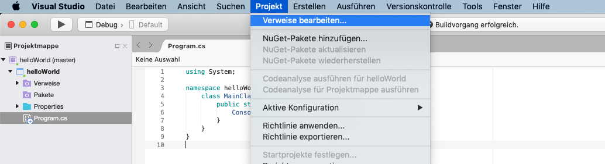
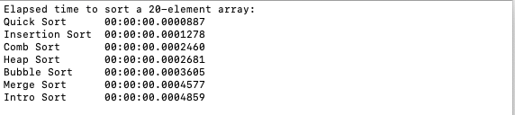
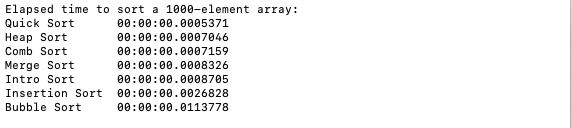
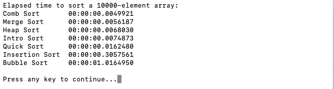
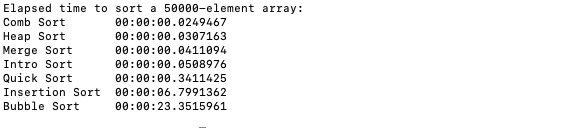

# Sorting-Algorithms-CSharp
Implementation of sorting algorithms in c# supporting every numeric data type. You can either include the source-code in your own project, or import the .dll file as reference.

## Content
* [How to use](#use)
* [Use as library](#library)
* [Algorithms](#algorithms)
* [Time complexity](#time-complexity)
* [Benchmarks](#benchmarks)
* [License](#license)
* [Contact](#contact)

## Algorithms 

* [MergeSort](https://en.wikipedia.org/wiki/Merge_sort)
* [IntroSort](https://en.wikipedia.org/wiki/Introsort)
* [QuickSort](https://en.wikipedia.org/wiki/Quicksort)
* [HeapSort](https://en.wikipedia.org/wiki/Heapsort)
* [BubbleSort](https://en.wikipedia.org/wiki/Bubble_sort)
* [SelectionSort](https://en.wikipedia.org/wiki/Selection_sort)

## Supported data types 

* sbyte
* byte
* short
* ushort
* int
* uint
* long
* ulong
* double
* float
* decimal

Every algorithm takes the unsorted array as parameter and returns the sorted array.
Every function is overloaded for very data type, thus you don't have to worry about different names when calling the functions with arrays of different types.

## How to use 
Just add the Sort.cs file to your project folder and use the implemented algorithms via Sort.XX

## How to use as library 

Add the .dll file as reference to your project

Select ".NET-Assembly" and search your download folder for the provided .dll file.

Select the file and you're ready to go!

## Time complexity
The time an algorithm takes to sort a certain array depends on its length. E.g. for short arrays selectionsort might be the best solution, whereas long arrays should always be sorted by quicksort, introsort, etc. (O(n*log(n))).

To find out, which algorithms is the fastest for you task, run the benchmark from the `benchmark.cs` file and specify the length of you array.

## Benchmarks
### 20-element array

### 1000-element array

### 10000-element array

### 50000-element array

### Built With
* [Visual Studio](https://visualstudio.microsoft.com)
* [Atom](https://atom.io/)

<!-- CONTRIBUTING -->
## Contributing

Contributions are what make the open source community such an amazing place to be learn, inspire, and create. Any contributions you make are **greatly appreciated**.

1. Fork the Project
2. Create your Feature Branch (`git checkout -b feature/AmazingFeature`)
3. Commit your Changes (`git commit -m 'Add some AmazingFeature`)
4. Push to the Branch (`git push origin feature/AmazingFeature`)
5. Open a Pull Request

<!-- LICENSE -->
## License

Distributed under the GNU LGPLv3 License. See `LICENSE` for more information.

<!-- CONTACT -->
### Contact

* Julian Schnabel - julianschnabel@outlook.com
* Project Link: [https://github.com/SchnJulian/Sorting-Algorithms-CSharp](https://github.com/SchnJulian/Sorting-Algorithms-CSharp)
